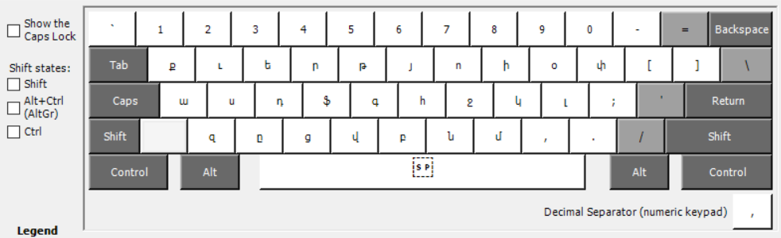
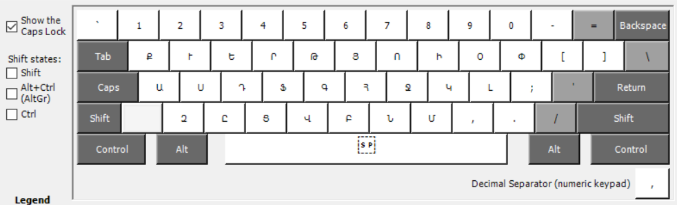
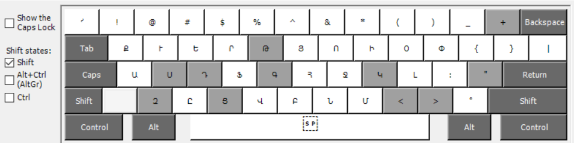
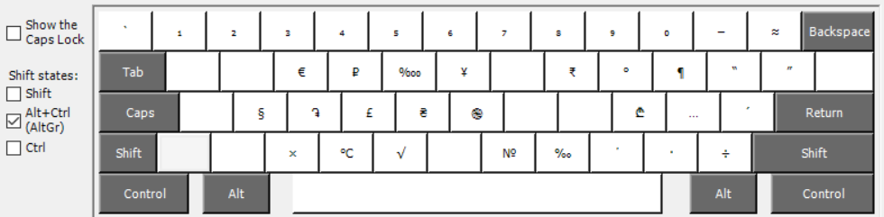

## Հայկական մնեմոնիկ ստեղնաշարի նախագիծը

&nbsp;&nbsp;&nbsp;&nbsp;Այս ստեղնաշարը ներառում է հայկական այբուբենի տառերը, թվանշաններ, [կետադրական](https://hy.wikipedia.org/wiki/%D5%80%D5%A1%D5%B5%D5%A5%D6%80%D5%A5%D5%B6%D5%AB_%D5%AF%D5%A5%D5%BF%D5%A1%D5%A4%D6%80%D5%B8%D6%82%D5%A9%D5%B5%D5%B8%D6%82%D5%B6) ու [մաթեմատիկական](https://hy.wikipedia.org/wiki/%D5%84%D5%A1%D5%A9%D5%A5%D5%B4%D5%A1%D5%BF%D5%AB%D5%AF%D5%A1%D5%AF%D5%A1%D5%B6_%D5%B6%D5%B7%D5%A1%D5%B6%D5%B6%D5%A5%D6%80) նշաններ, հայերենով խմբագրելիս հաճախ օգտագործվող հատուկ սիմվոլներ, ինչպես նաև այն հատուկ սիմվոլները, որոնք ներառված են անգլերեն ստեղնաշարում, հատկապես ամերիկյան տարբերակի՝ «US», որն ամենատարածվածն է այսօր։ Ստեղնաշարը մնեմոնիկ է, քանի որ յուրաքանչյուր տառ և նշան ասոցիացվում է լատինական տարբերակի տառերի, հնչյունների և գաղափարների հետ, և հետևաբար օգնում է հեշտ հիշել դրանց դիրքը լատինական ստեղնաշարի վրա։ [Տեղադրել](#տեղադրումը) հնարավոր է հայտնի օպերացիոն համակարգերի վրա, սակայն մինչ տեղադրելը՝ կարող եք փորձել ստեղնաշարը [վեբ-էջում](https://dotland.github.io/keymanweb-demo-hy/)։

&nbsp;&nbsp;&nbsp;&nbsp;Այս ստեղնաշարում ընդգրկված են բաղադրյալ (նաև՝ համր) ստեղներ։ Բաղադրյալ (համր) ստեղնը նախորդելով այլ ստեղնին՝ մուտքագրվում է հայկական տառ կամ նշան։ Օրինակ՝ **Շ** տառը մուտքագրելու համար անհրաժեշտ է սեղմել `S` այնուհետև `H`։ «US International»-ը նման ստեղնաշար է, որը հնարավորություն է տալիս մուտքագրել արևմտա-ևրոպական լեզուների տառեր. օրինակ՝ &nbsp;**à** տառը մուտքգրվում է՝ սեղմելով `՝` այնուհետև `a`։  Հետևյալ նկարներում պատկերված է հայկական մնեմոնիկ ստեղնաշարը՝ տարբեր մոդիֆիկատոր-ստեղների սեղմման վիճակում, որոնցում բաց մոխրագույնով նշված են բաղադրյալ (համր) ստեղները։


##### Նկ. 1. Հայկական մնեմոնիկ ստեղնաշարը
<p></p>

##### Նկ. 2. Հայկական մնեմոնիկ ստեղնաշարը `Caps Lock` ստեղնը միացրած
<p></p>

##### Նկ. 3. Հայկական մնեմոնիկ ստեղնաշարը `Shift` ստեղնը սեղմած 
<p></p>

##### Նկ. 4. Հայկական մնեմոնիկ ստեղնաշարը `AltGr` ստեղնը սեղմած
<p></p>

##### Նկ. 5. Հայկական մնեմոնիկ ստեղնաշարը `AltGr`+`Shift` ստեղների զուգակցությամբ 
<p></p>

Windows և Linux ՕՀ-երում `AltGr` ստեղնը ([Alt Graph](https://en.wikipedia.org/wiki/AltGr_key)) աջ `Alt` ստեղն է, իսկ macOS ՕՀ-ում այդ ստեղնին համապատասխանում է `⌥` ստեղնը ([Option](https://en.wikipedia.org/wiki/Option_key))։ Այլ ստեղնաշարներում, ինչպիսին են՝ «Armenian Phonetic» կամ «Armenian Typewriter», `AltGr` ստեղնով հնարավոր է մուտքագրել թվանշաններ, փակագծեր, շեղագծեր, իսկ `AltGr`+`Shift` ստեղների զուգակցությամբ՝ «US» ստեղնաշարի վրա գտնվող հատուկ սիմվոլները։


### Հայկական այբուբենը

&nbsp;&nbsp;&nbsp;&nbsp;Հետևյալ աղյուսակում ներկայացված է հայկական այբուբենը և լատինատառ տրանսլիտերացիան. <br />
1-ին սյունակում՝ տառի համարը, <br />
2-րդ սյունակում՝ տառի թվային արժեքը, <br />
3-րդ սյունակում՝ տառը (մեծատառ և փոքրատառ), <br />
4-րդ սյունակում՝ տառի անվանումը, <br />
5-րդ սյունակում՝ արտասանությունը լատինական ծագման լեզվում, <br />
6-րդ սյունակում՝ ստեղնը կամ ստեղների հաջորդականությունը, որոնց սեղմման արդյունքում մուտքագրվում է հայկական տառը, <br />
7-րդ սյունակում՝ մատները, որոնցով հնարավոր է արագ սեղմել համապատասխան ստեղները։ <br />


| №     | Թվային արժեքը | Տառը                  | Անվանումը | Արտասանությունը             | Ստեղն(եր)ը  | Մատները           |
| ---:  |    :----      |  :---                 | :---      |  :----                      | :---:       | :---              |
| 1     | 1             | Ա &nbsp; ա    | այբ       | *a* ( *art* )               |  `A`        | ձ. ճկույթ        |
| 2     | 2             | Բ &nbsp; բ    | բեն       | *b* ( *book* )              |  `B`        | ձ. ցուցամատ      |
| 3     | 3             | Գ &nbsp; գ    | գիմ       | *g* ( *goal* )              |  `G`        | ձ. ցուցամատ      |
| 4     | 4             | Դ &nbsp; դ    | դա        | *d* ( *destiny* )           |  `D`        | ձ. միջնեմատ      |
| 5     | 5             | Ե &nbsp; ե    | եչ        | բառասկզբում *ye* ( *yes* ) <br /> բաղաձայնից հետո *e* (*get*) |  `E`       | ձ. միջնեմատ |
| 6     | 6             | Զ &nbsp; զ    | զա        | *z* ( *zero* )              |  `Z`        | ձ. ճկույթ        |
| 7     | 7             | Է &nbsp; է    | էյ        | *'e* ( *end* )              |  `'` `E`    | ա. ճկույթ, ձ. միջնեմատ |
| 8     | 8             | Ը &nbsp; ը    | ըթ        | *e* ( *under* )             |  `X`        | ձ. մատնեմատ      |
| 9     | 9             | Թ &nbsp; թ    | թո        | *t* ( *table* )             |  `T`        | ձ. ցուցամատ      |
| 10    | 10            | Ժ &nbsp; ժ    | ժե        | *zh* ( *Zhitomir* )         |  `Z` `H`    | ձ. ճկույթ, ա. ցուցամատ |
| 11    | 20            | Ի &nbsp; ի    | ինի       | *i* ( *literal* )           |  `I`        | ա. միջնեմատ       |
| 12    | 30            | Լ &nbsp; լ    | լյուն     | *l* ( *love* )              |  `L`        | ա. մատնեմատ       |
| 13    | 40            | Խ &nbsp; խ    | խե        | *kh* ( *Khakassia* )        |  `K` `H`    | ա. միջնեմատ, ա. ցուցամատ |
| 14    | 50            | Ծ &nbsp; ծ    | ծա        | *ts* ( *Tsushima* )         |  `T` `S`    | ձ. ցուցամատ, ձ. մատնեմատ |
| 15    | 60            | Կ &nbsp; կ    | կեն       | *k* ( *Kazakhstan* )        |  `K`        | ա. միջնեմատ       |
| 16    | 70            | Հ &nbsp; հ    | հո        | *h* ( *head* )              |  `H`        | ա. ցուցամատ       |
| 17    | 80            | Ձ &nbsp; ձ    | ձա        | *dz* ( *Dzerzhinsk* )       |  `D` `Z`    | ձ. միջնեմատ, ձ. ճկույթ |
| 18    | 90            | Ղ &nbsp; ղ    | ղատ       | *gh* ( *Geghard* )          |  `G` `H`    | ձ. ցուցամատ, ա. ցուցամատ |
| 19    | 100           | Ճ &nbsp; ճ    | ճե        | *'j* ( *Japan* )            |  `'` `J`    | ա. ճկույթ, ա. ցուցամատ |
| 20    | 200           | Մ &nbsp; մ    | մեն       | *m* ( *mountain* )          |  `M`        | ա. ցուցամատ       |
| 21    | 300           | Յ &nbsp; յ    | հի        | *y* ( *yellow* )            |  `Y`        | ա. ցուցամատ       |
| 22    | 400           | Ն &nbsp; ն    | նու       | *n* ( *nation* )            |  `N`        | ա. ցուցամատ       |
| 23    | 500           | Շ &nbsp; շ    | շա        | *sh* ( *she* )              |  `S` `H`    | ձ. մատնեմատ, ա. ցուցամատ |
| 24    | 600           | Ո &nbsp; ո    | վօ        | բառասկզբում *vo* ( *voice* )  <br /> բառամիջում *o* ( *core* ) |  `U`        | ա. ցուցամատ       |
| 25    | 700           | Չ &nbsp; չ    | չա        | *ch* ( *child* )            |  `C` `H`    | ձ. միջնեմատ, ա. ցուցամատ |
| 26    | 800           | Պ &nbsp; պ    | պե        | *'p* ( *Petersburg* )       |  `'` `P`    | ա. ճկույթ, ա. մատնեմատ |
| 27    | 900           | Ջ &nbsp; ջ    | ջե        | *j* ( *jungle* )            |  `J`        | ա. ցուցամատ       |
| 28    | 1000          | Ռ &nbsp; ռ    | ռա        | *'r* ( *range* )            |  `'` `R`    | ա. ճկույթ, ձ. ցուցամատ |
| 29    | 2000          | Ս &nbsp; ս    | սե        | *s* ( *set* )               |  `S`        | ձ. մատնեմատ      |
| 30    | 3000          | Վ &nbsp; վ    | վեվ       | *v* ( *vision* )            |  `V`        | ձ. ցուցամատ      |
| 31    | 4000          | Տ &nbsp; տ    | տյուն     | *'t* ( *tent* )             |  `'` `T`    | ա. ճկույթ, ձ. ցուցամատ |
| 32    | 5000          | Ր &nbsp; ր    | րե        | *r* ( *raise* )             |  `R`        | ձ. ցուցամատ      |
| 33    | 6000          | Ց &nbsp; ց    | ցո        | *c* ( *Cicero* )            |  `C`        | ձ. միջնեմատ      |
| 34    | - [^u]        | ՈՒ &nbsp; ու  |           | *u* ( *put* )               |  `U` `W`    | ա. ցուցամատ, ձ. մատնեմատ |
| 35    | 7000          | Ւ &nbsp; ւ    | վյուն     | *v* ( *view* )              |  `W`        | ձ. մատնեմատ      |
| 36    | 8000          | Փ &nbsp; փ    | փյուր     | *p* ( *pen* )               |  `P`        | ա. ճկույթ         |
| 37    | 9000          | Ք &nbsp; ք    | քե        | *q* ( *queue* )             |  `Q`        | ձ. ճկույթ        |
| 38    | - [^yev]      | Եվ &nbsp; և   | եվ        | *yev* ( *Arsenyev* )        |  `'` `W`    | ա. ճկույթ, ձ. մատնեմատ |
| 39    | - [^o]        | Օ &nbsp; օ    | օ         | *o* ( *ocean* )             |  `O`        | ա. մատնեմատ       |
| 40    | - [^f]        | Ֆ &nbsp; ֆ    | ֆե        | *f* ( *feel* )              |  `F`        | ձ. ցուցամատ      |

[^u]: Բռնում է այբուբենի ւ տառի տեղը, թվային արժեքից զուրկ է։
[^yev]: Ավելացել է հետագայում։ Փոքրատառը ե, ւ տառերի կցագիրն է։
[^o]: Ավելացել է միջին դարերում, թվային արժեքից զուրկ է։
[^f]: Ավելացել է միջին դարերում, թվային արժեքից զուրկ է։

&nbsp;&nbsp;&nbsp;&nbsp;Մի մեծատառ մուտքագրելու համար անհրաժեշտ է, `Shift` ստեղնը սեղմած պահած, սեղմել տառին համապատասխան ստեղնը կամ առաջին ստեղնը, եթե երկուսն են։ Ստեղնաշարի վրա կան երկու `Shift` ստեղներ. արագ տպելու համար ձախ `Shift` ստեղնը սեղմում են ձախ ճկույթով, իսկ աջ `Shift` ստեղնը՝ աջ ճկույթով։ Եթե բառի բոլոր տառերը մեծատառ են, այն կարելի է արագ տպել հետևյալ կերպ. միացնել `Caps Lock` ստեղնը ձախ ճկույթով, մուտքագրել բառը, անջատել `Caps Lock` ստեղնը ձախ ճկույթով։ Արագ տպելու համար կարևոր է մատների ճիշտ տեղադրումը ստեղնաշարի վրա։ `F` և `J` ստեղներն ունեն կորնթարդություններ, ինչը կարելի է զգալ ցուցամատերով՝ չնայելով ստեղնաշարին։ Այդպես գտեք `F` և `J` ստեղները ցուցամատերով և դրեք մնացած մատները հաջորդ երեք ստեղների վրա երկու կողմից (ձախ կողմից՝ `A`–`F`, աջ կողմից՝ `J`–`;`)։ Այս դիրքը կոչվում է *ելման դիրք*։ Ցուցամատերը պետք են միշտ վերադառնան ելման դիրք՝ գտնելով `F` և `J` ստեղների կորնթարդությունները։ Իսկ բութ մատով կարելի է արագ սեղմել բացատը։ Հետևյալ նկարում պատկերված է մուտքագրման աղյուսակը, որն իրենից ներկայացնում է՝ արագ մուտքագրելու և հնարավոր սխալները կանխելու մեթոդ։ <br />

##### Նկ. 6. Մուտքագրման աղյուսակը
<p></p>

#### Արտահայտությունների օրինակներ

&nbsp;&nbsp;&nbsp;&nbsp;Օրինակների պարզության համար կատարենք այսպիսի նշանակում. **ը** փոքրատառին կհամապատասխանի `x` ստեղնը, իսկ **Ը** մեծատառին՝ `X` ստեղնը, որը նույնն է ինչ `Shift`+`x`, այսինքն՝ `Shift` ստեղնը սեղմած պահած՝ `x`: Հետևյալ աղյուսակում ներկայացված են արտահայտություններ՝ համապատասխան ստեղների հաջորդականություններով։

|  Արտահայտությունը           | Ստեղների հաջորդականությունը                                                                                                                 |
| :---                        |    :----                                                                                                                                    |
|  Պատերազմ եւ Խաղաղություն    | `'` `P` `a` `'` `t` `e` `r` `a` `z` `m`&nbsp;` `&nbsp;`e` `w`&nbsp;` `&nbsp;`K` `h` `a` `g` `h` `a` `g` `h` `u` `w` `t` `y` `u` `w` `n`     |
|  Ծանր ժամանակներ            | `T` `s` `a` `n` `r`&nbsp;` `&nbsp;`z` `h` `a` `m` `a` `n` `a` `k` `n` `e` `r`                                                               |
|  Քաոս և Անդորր              | `Q` `a` `u` `s`&nbsp;` `&nbsp;` `&nbsp;`'` `w`&nbsp;` `&nbsp;`A` `n` `d` `u` `r` `r`                                                        |
|  Ներկայի ուժը               | `N` `e` `r` `k` `a` `y` `i`&nbsp;` `&nbsp;`u` `w` `z` `h` `x`                                                                               |
|  Անձրեւը պետք է գա           | `A` `n` `d` `z` `r` `e` `w` `x`&nbsp;` `&nbsp;`'` `p` `e` `'` `t` `q`&nbsp;` `&nbsp;`'` `e`&nbsp;` `&nbsp;`g` `a`                           |
|  Արշալույսի հմայությունը    | `A` `r` `s` `h` `a` `l` `u` `w` `y` `s` `i`&nbsp;` `&nbsp;`h` `m` `a` `y` `u` `w` `t` `y` `u` `w` `n` `x`                                   |
|  Գեղատեսիլ ճապոնական թխկի   | `G` `e` `g` `h` `a` `'` `t` `e` `s` `i` `l`&nbsp;` `&nbsp;`'` `j` `a` `'` `p` `u` `n` `a` `k` `a` `n`&nbsp;` `&nbsp;`t`&nbsp;` `&nbsp;`k` `h` `k` `i` |

&nbsp;&nbsp;&nbsp;&nbsp;Նկատեք, որ *Քաոս* բառը մուտքագրելուց հետո սեղմվում է լրացուցիչ բացատ։ Դա անհրաժեշտ է, քանի որ `S` ստեղնը բաղադրյալ է, որը սեղմելուց հետո մուտքագրման համակարգը սպասում է այլ ստեղնի սեղմվելուն։ Նկատեք նաև, որ *թխկի* բառը մուտքագրելիս սեղմվում է բացատ *թ* տառից հետո։ Դա պայմանավորված է նրանով, որ `T` բաղադրյալ ստեղնին հաջորդում է `K` բաղադրյալ ստեղնը։ Սակայն [Keyman](#keyman) հարթակի վրա կամ [macOS](#macos) ՕՀ-ում այդպիսի բացատների կարիքը չկա, նաև, macOS ՕՀ-ում բաղադրյալ ստեղնը սեղմելիս, անմիջապես մուտքագվում է համապատասխան առաջին տառը՝ վառ ընդգծված։ Այս ստեղնաշարը նախագծվել է այնպես, որ բաղադրյալ ստեղները լինեն հնարավորինս չափ քիչ, և, հետևաբար, չդանդաղեցնի տպելը։ Ուշադրություն դարձրեք այն բանին, որ գոյականի՝ հաճախ հանդիպող *թյուն* վերջածանցին համապատասխանող ստեղները գտնվում են ցուցամատների մոտ, ինչպես անգլերենի *tion* վերջածանցը։ Դա, մյուս կողմից, նպաստում է արագ տպելուն։

### Հայկական կետադրությունը

&nbsp;&nbsp;&nbsp;&nbsp;Հայկական կետադրական նշանները բաժանվում են երեք խմբի՝ տրոհության, բացահայտության և առոգանության նշաններ։ Տրոհության նշաններն են՝ վերջակետը, միջակետը, ստորակետը, բութը, փակագծերը, որոնք ցույց են տալիս խոսքի, նախադասության մեջ քերականական արժեք ունեցող տրոհումները, դադարները։ Բացահայտության նշաններն են՝ չակերտները, միության գծիկը, անջատման գիծը, կախման կետերը, բազմակետը, ենթամնան, ապաթարցը, որոնք նպաստում են նախադասությունների մտքի, բառերի իմաստների, բաղադրիչների հարաբերության ճիշտ ընկալմանը։ Առոգանության նշաններն են՝ շեշտը, հարցականը, բացականչականը, որոնցով նշվում են հնչման ելևէջները՝ համապատասխան վերաբերմունք, հաղորդակցային երանգ արտահայտելու համար։

&nbsp;&nbsp;&nbsp;&nbsp;Հետևյալ աղյուսակում ներկայացված է հայկական կետադրական նշանները. <br />
1-ին սյունակում՝ [Յունիկոդ](http://unicode.org/standard/translations/armenian.html) համարը, <br />
2-րդ սյունակում՝ կետադրական նշանը, <br />
3-րդ սյունակում՝ նշանի անվանումը, <br />
4-րդ սյունակում՝ ստեղնը կամ ստեղները, որոնց միջոցով մուտքագրվում է նշանը, <br />
5-րդ սյունակում՝ նկարագրությունը, թե որտեղ է սովորաբար դրվում նշանը։

| Յունիկոդ №  | Նշանը   | Անվանումը       | Ստեղն(եր)ը    | Նկարագրությունը |
| :---        |  :---:  | :---            |    :---:      | :---            |
| [0589](https://unicode-table.com/ru/0589)        |  ։  | վերջակետ        |     `Shift`+`;`       | <details><summary>Դրվում է…</summary> Ա. Ինքնուրույն նախադասության վերջում՝ արտահայտելով համեմատաբար մեծ դադար նախադասությունների միջև։ <br /> Բ. Տողասկզբում գործածվող վերնագրից, ծանոթություն, վարժություն, խնդիր, առաջադրանք և նման բառերից կամ նրանց թվահամարից հետո։ <br /> Գ. Մատենագիտական ցանկում, տողատակում մատենագիտական ամեն մի ինքնուրույն հղումից հետո։ </details> |
| [002e](https://unicode-table.com/ru/002e)        |  .  | միջակետ         |     `.`       | <details><summary>Դրվում է…</summary> Ա. Բարդ համադասական նախադասության այնպիսի համադաս նախադասությունների միջև, որոնք կապված են առանց շաղկապի, ունեն զգալի ինքնուրույնություն և արտասանվում են զգալի դադարով։ <br /> Բ. Առանց շաղկապի կամ շաղկապական բառերի կապակցված այն նախադասությունների միջև, որոնցից մեկը մյուսի բացատրությունը, մեկնաբանությունն է։ <br /> Գ. Մեջբերվող ուղղակի խոսք ունեցող նախադաս հեղինակային խոսքից առաջ։ <br /> Դ. Առավելապես վերնագրերում այն բառերի, բառակապակցությունների միջև, որոնցից մեկն արտահայտում է մյուսի վերաբերյալ կամ նրա կապակցությամբ մասնավորում (հաճախ ենթավերնագիր), ընդհանրացում, լրացուցիչ միտք։ <br /> Ե. Թվարկում նշող թվականներից, տառերից հետո, ինչպիսին է՝ այս նշանի նկարագրության թվարկումը։ <br /> Զ. Այն թվարկվող միավորների միջև, որոնք արտահայտված են ծավալուն բառակապակցություններով կամ ունեն ստորակետով, շաղկապով նշված ներքին տրոհումներ։ <br /> Է. ԱՆվանում, կոչ, հարցադրում արտահայտող բառերից, բառակապակցություններից, նախադասություններից հետո, որոնց հաջորդում է դրանց հետ ուղղակիորեն կապված, դրանց անմիջականորեն վերաբերող կարծիք, գնահատություն։ <br /> Ը. Կանոններից, սահմանումներից հետո, երբ դրանց անմիջապես հաջորդում է օրինակը՝ առանց *օրինակ*, *ինչպես*, *այսպես* և նման բառերի, ինչպես և ընդհանրական մտքից հետո, որին հաջորդում է թվարկում։ <br /> Թ. Բառերի կրճատ գրված մասից հետո։ </details> |
| [002c](https://unicode-table.com/ru/002c)        |  ,  | ստորակետ        |     `,`       | <details><summary>Դրվում է…</summary> Ա. Գերադաս և ստորադաս նախադասությունների միջև։ <br /> Բ. Համադաս նախադասությունների միջև, երբ սրանք կապակցված են առանց շաղկապի կամ *իսկ*, *բայց*, *սակայն*, *մինչդեռ*, *այլ* և նման շաղկապներով։ <br /> Գ. *Եվ*, *ու*, *կամ* շաղկապներով կապակցված համադաս նախադասությունների միջև, որոնք չունեն ընդանուր ենթակա։ <br /> Դ. Նախադասության համադաս անդամների միջև, երբ սրանք կապակցված չեն *և*, *ու*, *կամ* շաղկապներով։ <br /> Ե. Միջանկյալ բառերի, բառակապակցությունների, նախադասությունների և նախադասության հիմնական մասի միջև։ <br /> Զ. Կոչականի և նախադասության հիմնական մասի միջև։ <br /> Է. Կրկնադիր *և...և*, *թե...թե*, *կամ...կամ*, *ոչ...ոչ* շաղկապներով կապակցված բառերի, նախադասությունների միջև։ <br /> Ը. Միջադաս տրոհված դերբայական դարձվածից առաջ և հետո։ <br /> Թ. *Ըստ*, *նայած*, *համապատասխան*, *համաձայն*, *հակառակ*, *հանդերձ* և նման կապերով ձևավորված տրոհված հիմունքի ու զիջման պարագաներից առաջ և հետո։ <br /> Ժ. Բացահայտչից հետո։ <br /> ԺԱ. Մեկնական բառից առաջ։ <br /> ԺԲ. Մատենագիտական աղբյուրի նկարագրության մեջ ներկայացվող տվյալների միջև։ </details> |
| [055d](https://unicode-table.com/ru/055d)        |  ՝  | բութ            |     `՝`       | <details><summary>Դրվում է…</summary> Ա. Բացահայտյալի վրա՝ բացահայտիչից անջատելու համար։ <br /> Բ. Նախադաս և հետադաս տրոհված դերբայական դարձվածների և նախադասության հիմնական մասի միջև։ <br /> Գ. *Ըստ*, *նայած*, *համապատասխան*, *համաձայն*, *հակառակ*, *հանդերձ*, *չհաշված* և նման կապերով ձևավորված նախադաս ու հետադաս տրոհված հիմունքի ու զիջման պարագաների և նախադասության մյուս անդամների միջև։ <br /> Դ. Անորոշ առումով թվարկված հետադաս բազմակի ենթականերից առաջ։ <br /> Ե. Թվարկմանը նախորդող բառի վրա, եթե թվարկվող բազմակի անդամները համարակալված են։ <br /> Զ. Նախադասության մեջ իրար հետ չկապվող, բայց իրար հաջորդող բառերից առաջինի վրա՝ իմաստային շփոթումը կանխելու համար։ <br /> Է. Թվարկում արտահայտող *նախ*, *ապա*, *առաջին*, *երկրորդ*, *երրորդ*, *չորրորդ* և նման այլ բառերի վրա։ <br /> Ը. Մեկնական *այսպես*, *այսպիսով*, *այն է*, *այսինքն*, *որոնք են*, *օրինակ* և նման բառերի վրա։ <br /> Թ. Նախադասության զեղչված անդամի կամ զեղչված բառի փոխարեն։ <br /> Ժ. Շատ հակիրճ, առավելապես մեկ բառով արտահայտված մեջբերվող ուղղակի խոսքից առաջ, երբ այն դրվում է առանց չակերտների։ <br /> ԺԱ. Կապակցված խոսքից դուրս գործածվող տեղեկատու արտահայտություններում՝ տեղեկույթ պահանջող բառի կամ կապակցության վրա։ </details> |
| [0028](https://unicode-table.com/ru/0028) <br /><br /> [0029](https://unicode-table.com/ru/0029)  |  ( <br /><br /> )  | բացվող (ձախ) փակագիծ <br /><br /> փակվող (աջ) փակագիծ  | `Shift`+`9` <br /><br /> `Shift`+`0`  | Փակագծերի մեջ են առնվում տեղեկատու, մեկնական իմաստ արտահայտող ներդրյալ բառերը, բառերի կապակցությունները, նախադասությունները։ |
| [00ab](https://unicode-table.com/ru/00ab) <br /><br /><br /> [00bb](https://unicode-table.com/ru/00bb)  |  « <br /><br /><br /> »  | բացվող (ձախ) չակերտ <br /><br /><br /> փակվող (աջ) չակերտ    | `"` `<` <br /><br /><br /> `"` `>`  | <details><summary>Առնվում են…</summary> Ա. Մեջբերվող ուղղակի խոսքը։ <br /> Բ. Գեղարվեստական երկերի, գիտական աշխատությունների, հոդվածների վերնագրերը, արվեստի ստեղծագործությունների, թերթերի, հանդեսների անունները խոսքում մեջբերվելիս։ <br /> Գ. Ընկերություններին, հիմնարկներին, ձեռնարկություններին տրվող պայմանական անունները, սարքերի, մեքենաների մակնիշները։ <br /> Դ. Հեգնական, ժխտական իմաստով գործածված բառերը, արտահայտությունները։ <br /> Ե. Բառը, լեզվական միավորը, որը հիշատակվում է խոսքում, և նրա մասին որևէ բան է ասվում։ </details> |
| [002d](https://unicode-table.com/ru/002d)        |  ‐    | միության գծիկ   |     `-`         | <details><summary>Գրվում են…</summary> Ա. Նույն բառի կրկնությամբ կազմված բարդ բառերը. *զույգ-զույգ*, *արագ-արագ*, *մեկ-մեկ*, *մանր-մունր*, *ոլոր-մոլոր*, *պարապ-սարապ* և այլն։ <br /> Բ. Միևնույն խոսքի մասին պատկանող բառերի այն միացությունները, որոնք, առարկան, անձը, իրը, երևույթը բնութագրելով կամ ներկայացնելով տարբեր կողմերից, արտահայտում են մեկ հասկացություն կամ հանդես են գալիս որպես մեկ անուն։ <br /> Գ. Բառերի այնպիսի միացությունները (առաջին բառի վերջածանցի կրճատումով), որոնք արտահայտում են տարբեր կողմերի (լեզուների, ժողովուրդների, պետությունների) հարաբերություններ։ <br /> Դ. Որևէ անունից (կամ ազգանունից) և *տեր*, *մելիք*, *միրզա* ու նման բաղադրիչներից կազմված անձնանունները (կամ ազգանունները), երբ նշված բաղադրիչներն արտասանվում են առանձին, օրինակ՝ *Տեր-Գաբրիելյան*։ <br /> Ե. *Ինչ* դերանունով բաղադրված անորոշ իմաստ արտահայտող բառերը՝ *ինչ-որ*, *փոքր-ինչ*, *դույզն-ինչ*։ <br /> Զ. Ավանդաբար գծիկով գրվող հատուկ անունները՝ *Նար-Դոս*, *Սայաթ-Նովա* և այլն։ <br /> Է. Թվականների այն կապակցությունները, որոնք արտահայտում են մոտավորության իմաստ՝ *չորս-հինգ (4-5) օր*, *տասը-տասնհինգ (10-15) մարդ* և այլն։ <br /> Ը. Այն բառաձևերն ու բառերը, որոնց հիմքերը գրված են թվանշաններով, տառային, վանկատառային հապավումներ են կամ փոխանուններ՝ *2-րդ*, *8-ական*, *XV-ի*, *ԱՊՀ-ից*, *գարուն-ը երկվանկ բառ է*։ <br /> Թ. Տառերով արտահայտված պայմանանիշերի, այլև բառերի և նրանց հետ գործածվող թվանշանների կապակցությունները, օրինակ՝ *ՏՈւ-104 ինքնաթիռ*։ </details> |
| [2013](https://unicode-table.com/ru/2013) <br /><br /><br /> [2014](https://unicode-table.com/ru/2014) |  – <br /><br /><br /> — | անջատման գիծ <br /><br /> երկար անջատման գիծ |   `AltGr`+`-` <br /><br /> `AltGr`+`Shift`+`-` | <details><summary>Դրվում է…</summary> Ա. Երկխոսության ամեն մի մասի սկզբում, որը սկսվում է նոր տողից. մեջբերվող ուղղակի խոսքի և հեղինակային խոսքի միջև նույն նախադասության մեջ դրվում է ստորակետ ու գիծ։ <br /> Բ. Խոսողի անվան և նրա խոսքի միջև (դրամատիկական ստեղծագործություններում, երկխոսություններում)։ <br /> Գ. Բառերի բացատրություններում՝ բացատրվող բառի և բացատրության միջև։ <br /> Դ. Բառերի (թվերի) միջև, որոնցից առաջինը ցույց է տալիս սկիզբ, սկզբնակետ (ունենալով բացառականի իմաստ), հաջորդը՝ վերջ, վերջակետ։ <br /> Ե. Թվարկումով ներկայացվող այնպիսի բառերի, բառակապակցությունների միջև, որոնցից հաջորդը նախորդի վերաբերյալ տալիս է որևէ տեղեկություն՝ արտահայտելով տարբեր հարաբերություններ (հեղինակ և ստեղծագործություն, դեր և դերասան և այլն)։ </details> |
| [2026](https://unicode-table.com/ru/2026)        |  ...    | կախման կետեր    |  `AltGr`+`;`    | <details><summary>Դրվում են…</summary> Ա. Այնպիսի նախադասության մեջ, որը լրիվ չի արտահայտում խոսողի ասելիքը, և նա ուզում է հատկապես նշել չդրսևորված հույզ, զգացմունք։ <br /> Բ. Նախադասության վերջում, մեջտեղում, սկզբում՝ պայմանավորված նրանով, թե չարտահայտված հույզը նախադասության հատկապես ո՛ր մասի հետ է կապվում։ </details> |
| [002e](https://unicode-table.com/ru/002e) [^4dot]  |  ....   | բազմակետ        | `.` `.` `.` `.` | Գործածվում է մեջբերումներում և դրվում է մեջբերման կրճատված մասի տեղում։ |
| [058a](https://unicode-table.com/ru/058a)          |  ֊      | ենթամնա         | `'` `-`         | Օգտագործվում է բառը տողադարձի ենթարկելու ժամանակ կամ այն վանկատելու համար։ Դրվում է բառի անջատված հատվածների միջև, օրինակ՝ դա֊սա֊գիրք, պա֊հա֊րան։ |
| [055a](https://unicode-table.com/ru/055a)          |  ՚      | ապաթարց         | `AltGr`+`,`     | <details><summary>Գործածվում է…</summary> Ա. Արևմտահայ գրական լեզվում. դրվում է բառի զեղչված ձայնավորի փոխարեն, հատկապես *կը*, *մը* մասնիկների *ը*-ի սղման դեպքում։ <br /> Բ. Արևմտյան *դ*, *Օ* և նման նախամասնիկներով կազմված հատուկ անուններում, որոնք համապատասխան լեզվում գրվում են ապաթարցով, օրինակ՝ *Ժաննա դ՚Արկ*։ </details> |
| [055b](https://unicode-table.com/ru/055b)          | ՛       | շեշտ            | `AltGr`+`'`     | <details><summary>Դրվում է…</summary> Ա. Հրամայական նախադասության մեջ՝ հրամայական բայաձևի, ինչպես և հրաման, կոչ, խնդրանք, հորդոր արտահայտող այլ բառերի վրա։ <br /> Բ. Կոչականի վրա, իսկ եթե նախադաս լրացումներ ունի, սովորաբար նրան նախորդող բառի վրա (բացի դերանունից)։ <br /> Գ. Կամային և բնաձայնական ձայնարկությունների վրա։ <br /> Դ. Նախադասության մեջ որևէ բառի վրա, որին խոսողը տրամաբանական, ոճական առումներով հատուկ կարևորություն է տալիս և ուզում է շեշտել։ </details> |
| [055e](https://unicode-table.com/ru/055e)          | ՞       | հարցական        | `Shift`+`/`     | Դրվում է այն բառերի վրա, որոնք ունեն հարցական հնչերանգ։ |
| [055c](https://unicode-table.com/ru/055c)          | ՜       | բացականչական    | `Shift`+`՝`     | Դրվում է այն բառերի վրա, որոնք ունեն բացականչական հնչերանգ։ |

[^4dot]: Յունիկոդ համար հատկացված չէ. մուտքագրվում է երեքից ավել միջակետերով։

&nbsp;&nbsp;&nbsp;&nbsp;Հայկական բութի նշանը պետք է տարբերել լատինականից. վերջինիս Յունիկոդ համարն է [0060](https://unicode-table.com/ru/0060) և մուտքագրվում է `AltGr`+`՝` զուգակցությամբ։ Ստեղներն այս դոկումենտացիայում նկարվել են՝ օգտագործելով հենց լատինական բութը։ Նաև հայկական վերջակետը պետք է տարբերել լատինական երկկետից. վերջինիս Յունիկոդ համարն է [003a](https://unicode-table.com/ru/003a) և մուտքագրվում է `AltGr`+`Shift`+`;` զուգակցությամբ։ Աղյուսակներն այս դոկումենտացիայում նկարվել են՝ օգտագործելով հենց լատինական երկկետը։ Լատինական նշանների և սիմվոլների առկայությունը այս նախագծում հնարավորություն է տալիս, առանց մուտքագրման լեզուն փոխելու, խմբագրել հայերենով այնպիսի դոկումենտացիաներ, ինչպիսին դուք կարդում եք հիմա։ 

#### Կետադրության օրինակներ

&nbsp;&nbsp;&nbsp;&nbsp;Հետևյալ աղյուսակում ներկայացված է արտահայտությունների օրինակներ կետադրությամբ՝ համապատասխան ստեղների հաջորդականություններով։ 

|  Արտահայտությունը                 | Ստեղների հաջորդականությունը   |
| :---                              |    :----                      |
| «Լույս» հրատարակչություն          | `"` `<` `L` `u` `w` `y` `s`&nbsp;` `&nbsp;`"` `>`&nbsp;` `&nbsp;`h` `r` `a` `'` `t` `a` `r` `a` `k`&nbsp;` `&nbsp;`c` `h` `u` `w` `t` `y` `u` `w` `n` |
| Է՜յ, լա՛վ կենաք, ակա՛նջ արեք.     | `'` `E` `~` `y` `,`&nbsp;` `&nbsp;`l` `a` `AltGr`+`'` `v`&nbsp;` `&nbsp;`k` `e` `n` `a` `q` `,`&nbsp;` `&nbsp;`a` `k` `a` `AltGr`+`'` `n` `j`&nbsp;` `&nbsp;`a` `r` `e` `q` `.` |
| – Ինչո՞ւ է աղմկում գետը,– հարցրեց նե։  | `AltGr`+`-`&nbsp;` `&nbsp;`I` `n` `c` `h` `u` `?` `w`&nbsp;` `&nbsp;`'` `e`&nbsp;` `&nbsp;`a` `g` `h` `m` `k` `u` `w` `m`&nbsp;` `&nbsp;`g` `e` `'` `t` `x` `,` `AltGr`+`-`&nbsp;` `&nbsp;`h` `a` `r` `c` `r` `e` `c`&nbsp;` `&nbsp;` `&nbsp;`n` `e` `:` |
| Հարգանքով՝ Պողոս ՊՈՂՈՍՅԱՆ         | `H` `a` `r` `g` `a` `n` `q` `u` `v` `՝`&nbsp;` `&nbsp;`"` `p` `u` `g` `h` `u` `s`&nbsp;` `&nbsp;` `&nbsp;`'` `P` `U` `G` `H` `U` `S` `Y` `A` `N` |

&nbsp;&nbsp;&nbsp;&nbsp;Առաջին օրինակում կարող եք նկատել երկու լրացուցիչ բացատներ. առաջինը՝ `S` և `"` բաղադրյալ ստեղների, իսկ երկրորդը՝ `K` և `C` բաղադրյալ ստեղների միջև։ Այդ բացատները անհրաժեշտ է մուտքագրել [Windows](#windows) և [Linux](#linux) ՕՀ-երում, իսկ [Keyman](#keyman) հարթակի վրա կամ [macOS](#macos) ՕՀ-ում՝ կարիք չկա։ Ինչպես երևում է՝ այն մեծատառերը, որոնք մուտքագրվում են `'` բաղադրյալ ստեղնով, կարելի է մուտքագրել երկու եղանակով. օրինակ՝ *Պ* տառը կարելի է մուտքագրել կամ `'` `P`, կամ `"` `p` ստեղների հաջորդականությամբ։ *ՊՈՂՈՍՅԱՆ* ազգանունը մուտքագրելիս, `'` ստեղնից առաջ կարելի է միացնել `Caps Lock` ստեղնը, մուտքագրել ազգանունը, այնուհետև անջատել `Caps Lock` ստեղնը։ 

### Հատուկ սիմվոլներ

&nbsp;&nbsp;&nbsp;&nbsp;[Յունիկոդի](http://unicode.org/standard/translations/armenian.html) հատուկ սիմվոլները կարող են մուտքագրվել տարբեր եղանակներով.

* Windows <br />
  ‣ սեղմած պահելով `Alt` ստեղնը, և [թվային ստեղնաշարով](https://en.wikipedia.org/wiki/Numeric_keypad) մուտքագրելով սիմվոլին համապատասխան [կոդը](https://www.alt-codes.net/), <br />
  ‣ +`.` ստեղների զուգակցությամբ, <br />
  ‣ `Fn` ստեղնի առկայության դեպքում, `Fn`+`Բացատ` ստեղների զուգակցությամբ, <br />
  ‣ անցնելով «Character Map», մկնիկի աջ կոճակով սեղմելով՝ խնդրագոտու վրա գտնվող Keyman պատկերակը, <br />
* macOS <br />
  ‣ `⌘`+`Ctrl`+`Բացատ` ստեղների զուգակցությամբ, <br />
* Linux <br />
  ‣ [հիմնական բաղադրյալ ստեղնի](https://en.wikipedia.org/wiki/Compose_key) և մնեմոնիկ ստեղների հաջորդականությամբ, <br />
  ‣ **gucharmap** (GNOME միջավայրում) կամ **kcharselect** (KDE միջավայրում) [հրամանների](https://fsymbols.com/character-maps/linux/) օգնությամբ։ <br />

&nbsp;&nbsp;&nbsp;&nbsp;Այս ստեղնաշարում, `AltGr` և `Shift` ստեղներով հասանելի են հաճախ օգտագործվող [հատուկ սիմվոլներ](#նկ-3-հայկական-մնեմոնիկ-ստեղնաշարը-shift-ստեղնը-սեղմած)։ Հետևյալ աղյուսակում ներկայացված են այն սիմվոլները, որոնք բացահայտորեն չեն երևում ստեղնաշարի սարքի վրա.

| Յունիկոդ №                                  | Սիմվոլը | Անվանումը       | Ստեղները      |
| :---                                        |  :---:  | :---            |    :---:      |
| [055f](https://unicode-table.com/ru/055f)   | ՟   | պատիվ[^pativ]   |   `/` `-`         |
| [00a7](https://unicode-table.com/ru/00a7)   | §   | բաժին           |   `AltGr`+`S`     |
| [00b6](https://unicode-table.com/ru/00b6)   | ¶   | ենթաբաժին       |   `AltGr`+`P`     |
| [2116](https://unicode-table.com/ru/2116)   | №   | համարանիշ       |   `AltGr`+`N`     |
| [2103](https://unicode-table.com/ru/2103)   | ℃  | աստիճան ըստ Ցելսիուսի | `AltGr`+`C`     |
| [00a4](https://unicode-table.com/ru/00a4)   | ¤   | արժույթ         |   `AltGr`+`Shift`+`X` |
| [058f](https://unicode-table.com/ru/058f)   | ֏   | դրամ            |   `AltGr`+`D`     |
| [20ac](https://unicode-table.com/ru/20ac)   | €   | եվրո            |   `AltGr`+`E`     |
| [20bd](https://unicode-table.com/ru/20bd)   | ₽   | ռուբլի          |   `AltGr`+`R`     |
| [20b4](https://unicode-table.com/ru/20b4)   | ₴   | հրիվնյա         |   `AltGr`+`G`     |
| [00a3](https://unicode-table.com/ru/00a3)   | £   | ֆունտ սթերլինգ  |   `AltGr`+`F`     |
| [20a3](https://unicode-table.com/ru/20a3)   | ₣   | ֆրանկ           |   `AltGr`+`Shift`+`F` |
| [20be](https://unicode-table.com/ru/20be)   | ₾   | լարի            |   `AltGr`+`Լ`     |
| [20a4](https://unicode-table.com/ru/20a4)   | ₤   | լիրա            |   `AltGr`+`Shift`+`Լ` |
| [00a5](https://unicode-table.com/ru/00a5)   | ¥   | յեն             |   `AltGr`+`Y`     |
| [20b9](https://unicode-table.com/ru/20b9)   | ₹   | րուպի           |   `AltGr`+`I`     |
| [2022](https://unicode-table.com/ru/2022)   | •   | ցանկի մակնշան կետային |   `AltGr`+`Shift`+`B` |
| [2023](https://unicode-table.com/ru/2023)   | ‣   | ցանկի մակնշան եռանկյունային |   `AltGr`+`Shift`+`V` |
| [2043](https://unicode-table.com/ru/2043)   | ⁃   | ցանկի մակնշան գծային |   `AltGr`+`Shift`+`N` |
| [007e](https://unicode-table.com/ru/007e)   | ~   | տիլդա           |   `AltGr`+`Shift`+`՝` |
| [0060](https://unicode-table.com/ru/0060)   | \`  | լատինական բութ  |   `AltGr`+`՝`     |
| [003a](https://unicode-table.com/ru/003a)   | :   | լատինական երկկետ  |   `AltGr`+`Shift`+`;` |
| [003f](https://unicode-table.com/ru/003f)   | ?   | լատինական հարցական  |   `AltGr`+`Shift`+`/` |
| [00a9](https://unicode-table.com/ru/00a9)   | ©   | հեղինակային իրավունք  |   `AltGr`+`Shift`+`C` |
| [00ae](https://unicode-table.com/ru/00ae)   | ®   | ապրանքանշանի իրավունք |   `AltGr`+`Shift`+`R` |
| [2122](https://unicode-table.com/ru/2122)   | ™   | ապրանքանիշ      |   `AltGr`+`Shift`+`T` |
| [2120](https://unicode-table.com/ru/2120)   | ℠  | սպասարկման նշան |   `AltGr`+`Shift`+`S` |
| [00aa](https://unicode-table.com/ru/00aa)   | ª   | դասական թվականի ցուցիչ (իգական)  |   `AltGr`+`A` |
| [00ba](https://unicode-table.com/ru/00ba)   | º   | դասական թվականի ցուցիչ (արական)  |   `AltGr`+`O` |
| [058e](https://unicode-table.com/ru/058e)   | ֎   | հայկական հավերժության նշան (ձախ) |  `AltGr`+`H` |
| [058d](https://unicode-table.com/ru/058d)   | ֍   | հայկական հավերժության նշան (աջ)  |  `AltGr`+`Shift`+`H` |

[^pativ]: Հնում հայ մատենագրության մեջ դրվել է համառոտագրված բառերի վրա։


### Մաթեմատիկական նշաններ և սիմվոլներ

&nbsp;&nbsp;&nbsp;&nbsp;Windows համակարգում&nbsp; +`.` &nbsp;ստեղների զուգակցությամբ հնարավոր է մուտքագրել մաթեմատիկական նշաններ և սիմվոլներ, հունական տառեր, հռոմեական թվեր, կոտորակներ, երկրաչափական և այլ սիմվոլներ։ Հայերենով խմբագրելիս՝ հաճախ օգտագործվող սիմվոլներն ու նշանները հնարավոր է մոտքագրել մնեմոնիկ ստեղների օգնությամբ, որը ներկայացված է հետևյալ աղյուսակում.

| Յունիկոդ №                                 | Սիմվոլը   | Անվանումը   | Ստեղները      |
| :---                                       |  :---:    | :---        |    :---:      |
| [00b0](https://unicode-table.com/ru/00b0)  | °     | աստիճան         |   `AltGr`+`Shift`+`Օ` |
| [2032](https://unicode-table.com/ru/2032)  | ′     | մանրագծիկ (րոպե, ոտնաչափ)      |   `/` `'`     |
| [2033](https://unicode-table.com/ru/2033)  | ″     | կրկնակի մանրագծիկ (վայրկյան, դույմ) |   `/` `"` |
| [2034](https://unicode-table.com/ru/2034)  | ‴     | եռակի մանրագծիկ |   `/` `;`     |
| [207a](https://unicode-table.com/ru/207a)  | ⁺     | տողավերևի գումարում |  `AltGr`+`Shift`+`P` |
| [207b](https://unicode-table.com/ru/207b)  | ⁻     | տողավերևի հանում |  `AltGr`+`Shift`+`M` |
| [00d7](https://unicode-table.com/ru/00d7)  | ×     | բազմապատկում    |   `AltGr`+`X` |
| [2219](https://unicode-table.com/ru/2219)  | ·     | բազմապատկում    |   `AltGr`+`.` |
| [2212](https://unicode-table.com/ru/2212)  | −     | հանում          |   `\` `-` |
| [00f7](https://unicode-table.com/ru/00f7)  | ÷     | բաժանում        |   `AltGr`+`Z` |
| [221a](https://unicode-table.com/ru/221a)  | √     | քառակուսի արմատ |   `AltGr`+`V` |
| [2248](https://unicode-table.com/ru/2248)  | ≈     | մոտավորապես հավասար լինել |  `AltGr`+`=` |
| [2261](https://unicode-table.com/ru/2261)  | ≡     | նույնական լինել |   `\` `=`     |
| [2260](https://unicode-table.com/ru/2260)  | ≠     | հավասար չլինել  |   `/` `=`     |
| [00b1](https://unicode-table.com/ru/00b1)  | ±     | պլյուս-մինուս   |   `\` `+`     |
| [2264](https://unicode-table.com/ru/2264)  | ≤     | փոքր կամ հավասար լինել |  `\` `<`   |
| [2265](https://unicode-table.com/ru/2265)  | ≥     | մեծ կամ հավասար լինել |   `\` `>`   |
| [221e](https://unicode-table.com/ru/221e)  | ∞     | անվերջություն   |   `\` `8`     |
| [2030](https://unicode-table.com/ru/2030)  | ‰     | հազարերորդական մաս  |   `AltGr`+`M`   |
| [2031](https://unicode-table.com/ru/2031)  | ‱    | տասը հազարերորդական մաս  |   `AltGr`+`T`   |
| [2329](https://unicode-table.com/ru/2329)  | 〈     | ձախ անկյունային փակագիծ | `\` `[` |
| [232a](https://unicode-table.com/ru/232a)  | 〉     | աջ անկյունային փակագիծ | `\` `]` |
| [2220](https://unicode-table.com/ru/2220)  | ∠    | անկյուն         |   `/` `L`     |
| [221f](https://unicode-table.com/ru/221f)  | ∟     | ուղիղ անկյուն   |   `\` `L`     |
| [27c2](https://unicode-table.com/ru/27c2)  | ⟂     | ուղղահայաց լինել |   `\` `T`     |
| [2200](https://unicode-table.com/ru/2200)  | ∀     | բոլորի համար    |   `\` `A`     |
| [2203](https://unicode-table.com/ru/2203)  | ∃     | գոյություն ունենալ |   `\` `E`     |
| [2204](https://unicode-table.com/ru/2204)  | ∄      | գոյություն չունենալ  | `/` `E`     |
| [2228](https://unicode-table.com/ru/2228)  | ∨     | տրամաբանական գումարում (կամ) | `\` `V` |
| [2227](https://unicode-table.com/ru/2227)  | ∧     | տրամաբանական բազմապատկում (և) | `/` `V` |
| [00ac](https://unicode-table.com/ru/00ac)  | ¬      | տրամաբանական ժխտում (ոչ)     |   `/` `N`   |
| [2205](https://unicode-table.com/ru/2205)  | ∅     | դատարկ բազմություն  | `/` `0` |
| [227a](https://unicode-table.com/ru/227a)  | ≺     | նախորդել     |   `\` `{`   |
| [227b](https://unicode-table.com/ru/227b)  | ≻     | հաջորդել     |   `\` `}`   |
| [2282](https://unicode-table.com/ru/2282)  | ⊂     | ենթաբազմություն լինել |   `\` `C`   |
| [2284](https://unicode-table.com/ru/2284)  | ⊄     | ենթաբազմություն չլինել | `/` `C` |
| [2208](https://unicode-table.com/ru/2208)  | ∈     | պատկանել |   `\` `B`   |
| [2209](https://unicode-table.com/ru/2209)  | ∉     | չպատկանել    |  `/` `B`  |
| [222a](https://unicode-table.com/ru/222a)  | ∪     | միավորում     |   `\` `U`   |
| [2229](https://unicode-table.com/ru/2229)  | ∩     | հատում      |   `/` `U`   |
| [2218](https://unicode-table.com/ru/2218)  | ∘     | օղակ օպերատոր |   `\` `O` |
| [2217](https://unicode-table.com/ru/2217)  | ∗     | աստղանիշ օպերատոր |  `\` `*` |
| [22c6](https://unicode-table.com/ru/22c6)  | ⋆     | աստղ օպերատոր   |   `/` `*`   |
| [21a6](https://unicode-table.com/ru/21a6)  | ↦     | ապացույցի սկիզբ |   `/` `>`   |
| [21b5](https://unicode-table.com/ru/21b5)  | ↵     | ապացույցի ավարտ  |   `/` `<`   |

&nbsp;&nbsp;&nbsp;&nbsp;Տողատակի թվերը մուտքագրվում են `AltGr` և թվային ստեղների զուգակցությամբ, իսկ տողավերևի թվերը՝ `AltGr`+`Shift` և թվային ստեղների զուգակցությամբ։ Այս թվերը կարող են օգտակար լինել, երբ անհրաժեշտ է թիվը կամ ֆիզիկական մեծության միավորը բարձրացնել ամբողջ թվի աստիճան ( 6.674×10⁻¹¹ մ³·կգ⁻¹·վ⁻² ), գրել կոտորակներ ( ³/₅ ), քիմիական բանաձևեր կամ ռեակցիաներ ( H₂O ) և այլն:

### Տեղադրումը

#### Keyman

&nbsp;&nbsp;&nbsp;&nbsp;[Keyman](https://keyman.com/about/)-ը անվճար և բաց կոդով ստեղնաշարի հարթակ է և հասանելի է հայտնի ՕՀ-երի համար, այդ թվում՝ [Windows](https://keyman.com/windows/)-ի, [macOS](https://keyman.com/mac/)-ի, [Linux](https://keyman.com/linux/)-ի, [Android](https://keyman.com/android/)-ի, [iOS](https://keyman.com/iphone-and-ipad/)-ի, և նաև [Վեբի](https://keymanweb.com/) համար: «Armenian Mnemonic» Kayman ստեղնաշարը տեղադրելու համար այցելեք [այս էջը](https://github.com/dotland/mnemonic-kb-hy-/blob/main/README.md), իսկ «Armenian Mnemonic R» Kayman ստեղնաշարի համար այցելեք [այս էջը](https://github.com/dotland/mnemonic-kb-hy-r/blob/main/README.md)։ «Armenian Mnemonic R» ստեղնաշարում `T` և `P` ստեղներով մուտքագրվում է Տ և Պ տառերը, իսկ «Armenian Mnemonic» ստեղնաշարում՝ Թ և Փ տառերը համապատասխանաբար։ Հայերեն տեքստի [վերլուծությունը](https://gist.github.com/dotland/2c0ce1a63804c2ea651b750cad3235b0) ցույց է տալիս, որ Տ և Պ տառերը հանդիպում են մոտ երկու անգամ ավելի հաճախ, քան Թ և Փ տառերը։ Ուստի նախընտրելի է [«Armenian Mnemonic R»](https://github.com/dotland/mnemonic-kb-hy-r/blob/main/README.md) ստեղնաշարը։ <br />
&nbsp;&nbsp;&nbsp;&nbsp;Keyman-ի այս ստեղնաշարները ունեն կցագրեր մուտքագրելու հատկություն, որը կարելի է միացնել կամ անջատել ստեղնաշարի կարգավորումներից։

#### Windows

&nbsp;&nbsp;&nbsp;&nbsp;Ներբեռնեք [HYM.zip](https://github.com/dotland/mnemonic-kb-hy/releases/latest/download/HYM.zip) ֆայլը, ապաարխիվացրեք և գործարկեք նրանում գտնվող&nbsp; **setup.exe** &nbsp;ֆայլը որպես ադմինիստրատոր։ Հաջող տեղադրումից հետո վերագործարկեք ՕՀ-ը, որից հետո կարող եք ընտրել&nbsp; «Armenian Mnemonic»  &nbsp;մուտքագրման լեզուն՝&nbsp; +`Բացատ` &nbsp;ստեղների զուգակցությամբ։ <br />
&nbsp;&nbsp;&nbsp;&nbsp;Հաշվի առնելով, վերը նշված [օրինակներում](#կետադրության-օրինակներ) նկարագրված, լրացուցիչ բացատների հարցը՝ [Keyman](#keyman) տարբերակը ավելի նախընտրելի է, քան այս մեկը։

#### macOS

&nbsp;&nbsp;&nbsp;&nbsp;Ներբեռնեք [HYM.dmg](https://github.com/dotland/mnemonic-kb-hy/releases/latest/download/HYM.dmg) ֆայլը (կամ [HYMR.dmg](https://github.com/dotland/mnemonic-kb-hy/releases/latest/download/HYMR.dmg) ֆայլը «Armenian - Mnemonic R» ստեղնաշարի համար) և գործարկեք։ Բացված պատուհանից գործարկեք&nbsp; **Keyboard Installer** &nbsp;և կբացվի նոր պատուհան երկու մեծ կոճակով։ Քաշեք&nbsp; **HYM.bundle** &nbsp;ֆայլը երկու կոճակների ներքևի տարածքը։ Տեղադրելու համար սեղմեք կոճակներից մեկը. առաջինը՝ ընթացիկ օգտագործողի համար, երկրորդը՝ բոլորի համար։ Հաջող տեղադրումից հետո վերագործարկեք ՕՀ-ը, այնուհետև ավելացրեք առաջին&nbsp; «Armenian - Mnemonic» (կամ «Armenian - Mnemonic R») &nbsp;մուտքագրման աղբյուրը ՕՀ-ի կարգավորումներից։ Մուտքագրման լեզուն հնարավոր է փոխել՝&nbsp; `⌘`+`Բացատ` &nbsp;ստեղների զուգակցությամբ։

#### Linux

&nbsp;&nbsp;&nbsp;&nbsp;Բացեք տերմինալը&nbsp; `Ctrl`+`Alt`+`T` &nbsp;ստեղների զուգակցությամբ և գործարկեք հետևյալ հրամանները.

```shell
git clone https://github.com/dotland/mnemonic-kb-hy.git
cd mnemonic-kb-hy/linux
sudo ./install.sh
```

Հաջող տեղադրումից հետո վերագործարկեք ՕՀ-ը, այնուհետև ավելացրեք&nbsp; «Armenian (mnemonic)» &nbsp;մուտքագրման աղբյուրը ՕՀ-ի կարգավորումներից։ Մուտքագրման լեզուն հնարավոր է փոխել՝&nbsp; `❖`+`Բացատ` &nbsp;ստեղների զուգակցությամբ։ <br />
&nbsp;&nbsp;&nbsp;&nbsp;Հաշվի առնելով, վերը նշված [օրինակներում](#կետադրության-օրինակներ) նկարագրված, լրացուցիչ բացատների հարցը՝ [Keyman](#keyman) տարբերակը ավելի նախընտրելի է, քան այս մեկը։


### Հղումներ

<a id="1">&nbsp;&nbsp;1.&nbsp;</a>
[Եզեկյան Լ. Կ. – Հայոց լեզու, Երևան, ԵՊՀ հրատ., 2007։](https://library.anau.am/images/stories/grqer/Lezvabanutyun/Ezekyan.pdf) <br />
<a id="2">&nbsp;&nbsp;2.&nbsp;</a>
[Յունիկոդ Ստանդարտ – Ի՞նչ է Յունիկոդը։](http://unicode.org/standard/translations/armenian.html) <br />
<a id="3">&nbsp;&nbsp;3.&nbsp;</a>
[Յունիկոդ Ստանդարտ – Հայկական աղյուսակը։](https://unicode.org/charts/PDF/U0530.pdf) <br />
<a id="4">&nbsp;&nbsp;4.&nbsp;</a>
[Յունիկոդ սիմվոլների աղյուսակ – Հավաքածուները։](https://unicode-table.com/en/sets/) <br />
<a id="5">&nbsp;&nbsp;5.&nbsp;</a>
[Վիքիպեդիա ազատ հանրագիտարան – Հայերենի այբուբենը։](https://hy.m.wikipedia.org/wiki/%D5%80%D5%A1%D5%B5%D5%A5%D6%80%D5%A5%D5%B6%D5%AB_%D5%A1%D5%B5%D5%A2%D5%B8%D6%82%D5%A2%D5%A5%D5%B6) <br />
<a id="6">&nbsp;&nbsp;6.&nbsp;</a>
[Վիքիպեդիա ազատ հանրագիտարան – Հայերենի կետադրությունը։](https://hy.wikipedia.org/wiki/%D5%80%D5%A1%D5%B5%D5%A5%D6%80%D5%A5%D5%B6%D5%AB_%D5%AF%D5%A5%D5%BF%D5%A1%D5%A4%D6%80%D5%B8%D6%82%D5%A9%D5%B5%D5%B8%D6%82%D5%B6) <br />
<a id="7">&nbsp;&nbsp;7.&nbsp;</a>
[Վիքիպեդիա ազատ հանրագիտարան – Մաթեմատիկական նշաններ։](https://hy.wikipedia.org/wiki/%D5%84%D5%A1%D5%A9%D5%A5%D5%B4%D5%A1%D5%BF%D5%AB%D5%AF%D5%A1%D5%AF%D5%A1%D5%B6_%D5%B6%D5%B7%D5%A1%D5%B6%D5%B6%D5%A5%D6%80) <br />
<a id="8">&nbsp;&nbsp;8.&nbsp;</a>
[Վիքիպեդիա ազատ հանրագիտարան – Յունիկոդ Ստանդարտի հայկական աղյուսակը։](https://en.wikipedia.org/wiki/Armenian_(Unicode_block)) <br />
<a id="9">&nbsp;&nbsp;9.&nbsp;</a>
[«Armenian Mnemonic R» Keyman ստեղնաշարը։](https://github.com/dotland/mnemonic-kb-hy-r/blob/main/README.md) <br />
<a id="10">10.&nbsp;</a>
[Русская мнемоническая раскладка клавиатуры.](https://github.com/dotland/mnemonic-kb-ru/blob/main/README.md) <br />
<a id="11">11.&nbsp;</a>
[Հայերենի բառարանային մոդել։](https://github.com/dotland/lexical-model-hy/blob/main/README.md) <br />
