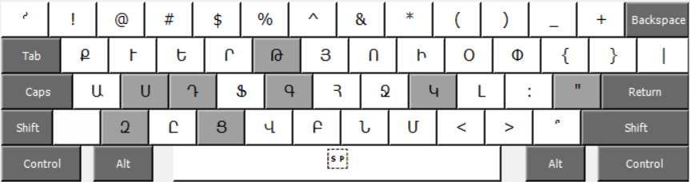
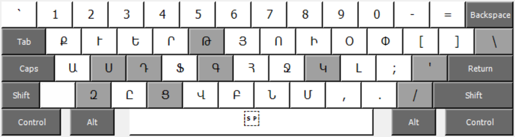

## Մնեմոնիկ հայկական ստեղնաշարի սխեմա

Ստեղնաշարի այս սխեման ներառում է հայոց լեզվի 40 տառ, կետադրական ու մաթեմատիկական նշաններ, և այլ հատուկ սիմվոլներ, որոնք ներառված են անգլերեն ստեղնաշարի սխեմայում, հատկապես ամերիկյան տարբերակի՝ `US`, որն ամենատարածվածն է այսօր։ Ստեղնաշարի սխեման մնեմոնիկ է, քանի որ յուրաքանչյուր տառ և նշան ասոցիացվում է լատինական տարբերակի տառերի, հնչյունների և գաղափարների հետ, հետևաբար օգնում է հեշտ հիշել դրանց դիրքը լատինական ստեղնաշարի վրա։

Այս սխեման պարունակում է բաղադրյալ ստեղներ։ Բաղադրյալ ստեղնը համադրելով այլ ստեղնի հետ տպվում է հայկական տառ կամ նշան։ Օրինակ՝ `է` տառը տպելու համար անհրաժեշտ է հաջորդականորեն սեղմել `'ե`։ Հետևյալ նկարներում պատկերված է մնեմոնիկ հայկական ստեղնաշարի սխեման, որտեղ բաց մոխրագույնով նշված են բաղադրյալ ստեղները։

### Հայկական այբուբենը և համապատասխան ստեղները
