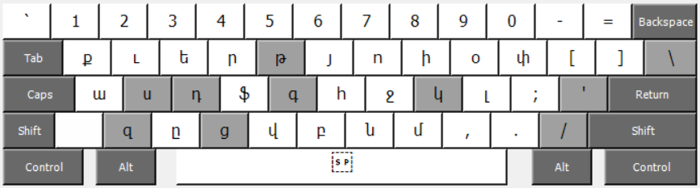
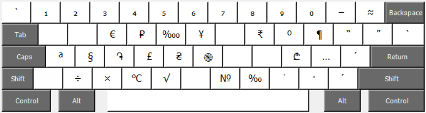
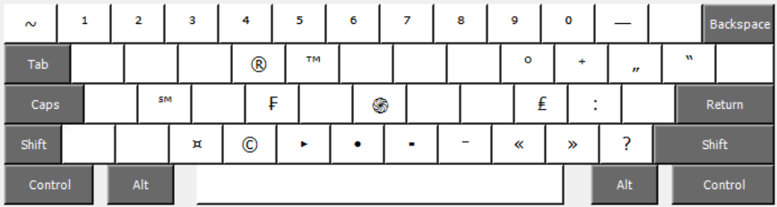

## Դոկումենտացիայում օգտագործված նկարները

Այս դիրեկտորիան պարունակում է նկարներ՝ օգտագործված դոկումենտացիայում։

Հետևյալ նկարներում պատկերված է հայկական մնեմոնիկ ստեղնաշարի սխեման, որոնցում բաց մոխրագույնով նշված են բաղադրյալ ստեղները։

##### Նկ. 1. Հայկական մնեմոնիկ ստեղնաշարը

##### Նկ. 2. Հայկական մնեմոնիկ ստեղնաշարը `Caps Lock` ստեղնը սեղմած

##### Նկ. 3. Հայկական մնեմոնիկ ստեղնաշարը `Shift` ստեղնը սեղմած 

##### Նկ. 4. Հայկական մնեմոնիկ ստեղնաշարը `AltGr` ստեղնը սեղմած

##### Նկ. 5. Հայկական մնեմոնիկ ստեղնաշարը `AltGr`+`Shift` ստեղների զուգակցությամբ 

Windows և Linux ՕՀ-երում `AltGr` ստեղնը (Alt Graph) աջ `Alt` ստեղն է, իսկ macOS ՕՀ-ում այդ ստեղնին համապատասխանում է `⌥` ստեղնը (Option)։
